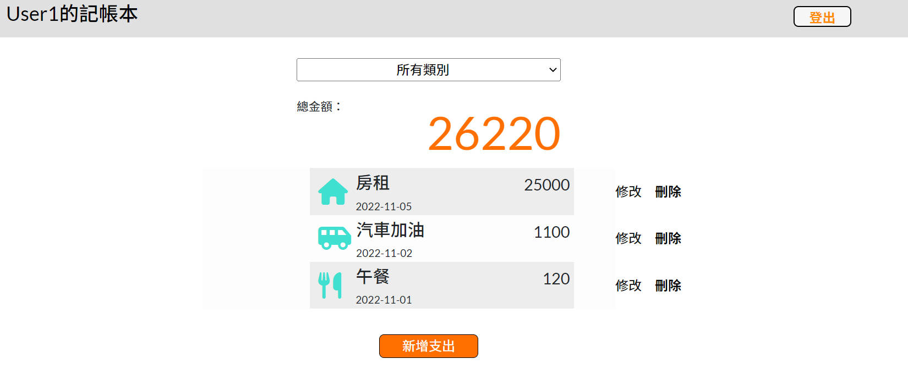
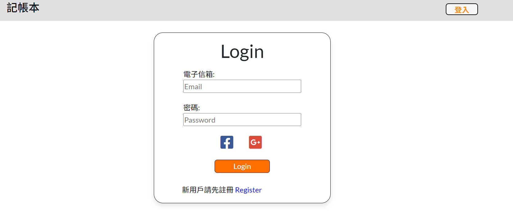

# Expense Track
小小記帳本
記錄自己的支出項目

## 主要功能
- 需註冊登入才能使用
- 首頁可以查看所有支出
- 可以根據「類別」篩選支出
- 新增支出
- 修改支出
- 刪除支出

## 使用者驗證
需註冊，並登入使用
有提供第三方登入:
- Facebook
- Google

### Screen Photos
#### 首頁

#### 登入驗證

## Get Start
1. 確保已安裝好Node.js

2. 透過終端輸入指令將此專案clone到你的本機 : 
  `git clone https://github.com/AlanSquid/expense-track.git`

3. 在專案資料夾內安裝npm套件 : 
   `npm install `

4. 環境變數設定請參考.env.example

5. 建立種子資料請在終端輸入: `npm run seed` 

   種子帳密:
   - user1@test.com, 123456
   - user2@test.com, 123456

6. 執行:
  `npm run start`

7. 執行成功終端會顯示: App is running on http://localhost:3000 

8. 欲結束執行可在終端輸入`ctrl + C`

  

